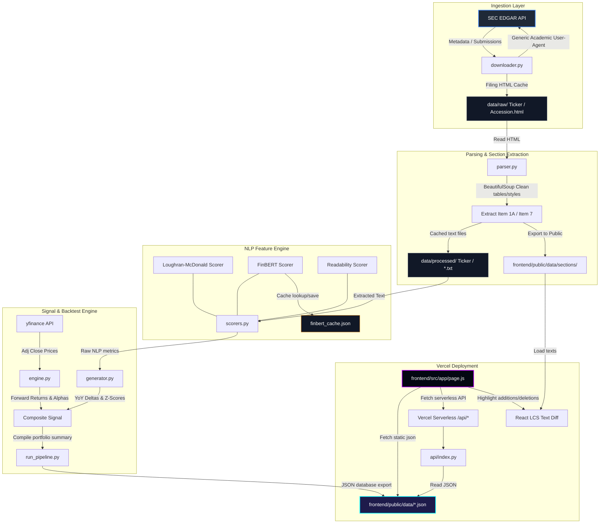

# SEC Filing NLP Alpha Engine

An academic textual-alpha research and backtesting platform that mines SEC filings (10-K, 10-Q) for sentiment and linguistic signals, then evaluates their historical predictive power (alpha) on stock returns.

This project is structured as a **Vercel-ready monorepo** with a separated Python backend and Next.js frontend, enabling local processing of heavy natural language models and sub-second web rendering at scale.

---

## System Topology & Data Flow

The following diagram illustrates the process from raw SEC EDGAR ingestion through NLP scoring, signal compilation, and dashboard rendering:



---

## Documentation Folders

Detailed documentation is available in the dedicated [docs/](file:///g:/sec_nlp/docs/) directory:

1.  **[System Architecture Guide](file:///g:/sec_nlp/docs/architecture.md):** Detailed technical layout, data topology flows, and modular design.
2.  **[NLP Layer Engineering](file:///g:/sec_nlp/docs/nlp.md):** Design principles, generic dictionary shortcomings, and FinBERT sentence chunking strategies.
3.  **[Technical Terms & Models Specification](file:///g:/sec_nlp/docs/technical_terms.md):** Deep-dive into FinBERT tokenization, the Loughran-McDonald negation logic, Gunning Fog equations, and the LCS sentence diff algorithm.
4.  **[Finance Concepts & Metrics Reference](file:///g:/sec_nlp/docs/finance_terms.md):** Information Coefficient (IC) formulations, CIK definitions, holding period return calculations, alpha z-scoring, and PEAD anomalies.
5.  **[Data Schema & Cache Structures](file:///g:/sec_nlp/docs/data.md):** JSON schemes of `summary.json` and `{TICKER}.json` files, CSV structure of cached stock prices, and FinBERT json caching layout.
6.  **[Command Reference Guide](file:///g:/sec_nlp/docs/commands.md):** Details all pipeline execution parameters, setup, test discoverers, and cache-clearing instructions.

---

## Installation & Setup

### Prerequisites
1.  **Python 3.8+**
2.  **Node.js 18+**

### Step-by-Step Installation
Run the root setup command to install dependencies for both Python (backend) and npm (frontend):

```bash
npm run setup
```

---

## How to Run

All main actions can be triggered from the project root directory:

### 1. Run Unit Tests
Verifies CIK resolution, section parsers, Loughran-McDonald negation scorer, and signal z-scoring logic:
```bash
npm run test
```

### 2. Run the Data Pipeline (Backend Compiler)
Ingests recent filings, extracts text sections, calculates sentiment scores, downloads historical prices, and builds return metrics.

*   **Fast Run (Dictionary Sentiment Only - Recommended for Testing):**
    ```bash
    npm run pipeline-fast
    ```
*   **Full Run (Includes FinBERT Neural Network Scoring - CPU Heavy):**
    ```bash
    npm run pipeline
    ```
    *Note: FinBERT scores are cached automatically in `backend/data/finbert_cache.json` after the first run.*

### 3. Launch the Frontend Dashboard
Starts the Next.js development server:
```bash
npm run dev
```

### 4. Run Both Together
Compiles the latest signals using the fast pipeline, then immediately launches the frontend:
```bash
npm run start
```
Once started, the interactive dashboard is accessible at [http://localhost:3000](http://localhost:3000).

---

## Core Features & Methodology

1.  **SEC Compliance Downloader:** Resolves tickers to CIKs using `company_tickers.json` and fetches metadata. Downloads filing contents using a compliant user agent header and rate limits requests to under 10/sec.
2.  **Parsing & Cleaning:** BeautifulSoup strips out script/style tags and table elements (to filter financial numbers from text statistics).
3.  **NLP Scoring:** Computes Loughran-McDonald financial sentiment rates, negation-adjusted positive words, and text complexity (Gunning Fog Index).
4.  **Backtest Return Calculation:** Integrates with `yfinance` to fetch holding period returns (1d, 5d, 21d, 63d) around filing events and benchmarks them against SPY to compute raw alpha.
5.  **Signal Construction:** Normalizes YoY deltas and z-scores them cross-sectionally to produce the `composite_signal` score.
6.  **Interactive Sentiment Trend & Correlation Charts:**
    *   *Tone Trend View:* SVG line chart displaying FinBERT and LM scores with auto-zoomed ranges, translucent area gradients, and vertical gridlines.
    *   *Shift vs. Alpha View:* Grouped bar chart comparing YoY sentiment z-score shifts (success/danger colors) alongside 21d abnormal return alphas (primary/secondary colors) with CSS hover highlights and click synchronization.
7.  **Loughran-McDonald Lexicon Overhaul:** A tabbed analysis center displaying:
    *   *Sentiment Profile:* A visual net tone slider, lexicon density progress bars, and interactive contributing word tag clouds (size and opacity scaled by frequency).
    *   *Historical Trajectory:* SVG trajectory line graph tracing positive, negative, and uncertainty rates chronologically with hover details and coordinate sync.
    *   *Theory Explainer:* Academic rationale behind financial dictionaries, uncertainty loads, and negation lookback rules.
8.  **Vercel Analytics:** Integrated tracking of production performance, web vitals, and page impressions.
9.  **Static Data Integration:** The backend exports data directly into `/frontend/public/data/` as static JSON files. The Next.js frontend fetches these files client-side, enabling zero-cold-start speeds and instant page loads when deployed on Vercel.
