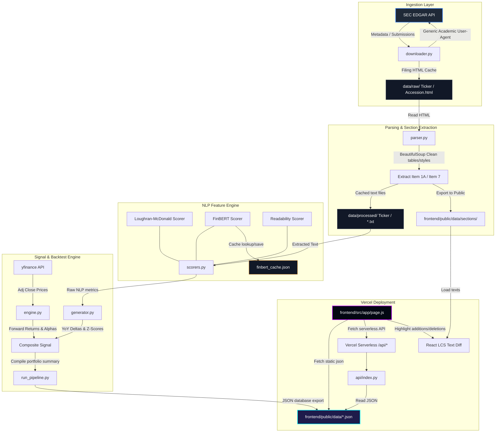

# System Architecture

The **SEC Filing NLP Alpha Engine** is structured as an offline-first data compiler coupled with a serverless web dashboard. The design ensures high performance, zero runtime database overhead, and seamless Vercel deployment.

---

## System Topology Diagram

The following Mermaid diagram visualizes the data flow from source ingestion through natural language processing, backtesting, and visualization:

---

## Architectural Components

### 1. Data Ingestion Layer (`backend/data_pipeline/downloader.py`)
Queries the SEC submissions API using CIK lookups. Downloads filings incrementally and caches raw HTML locally to `data/raw/` to ensure we never query the SEC server twice for the same document. It sleep-throttles requests (0.15s per query) to stay safely below the SEC's limit of 10 requests per second.

### 2. Sanitization & Section Parsing (`backend/data_pipeline/parser.py`)
Cleans raw filing pages.
*   **Table Removal:** Discards HTML `<table>` elements to strip numbers, financial tables, and tickers from text, preventing them from corrupting text readability scores.
*   **Regex Section Extraction:** Isolates MD&A (Management's Discussion & Analysis) and Risk Factors (Item 1A) using a multi-pattern regex matching cascade that defaults to Part/Section headers or document-end boundaries.

### 3. Scoring & Processing Pipeline (`backend/nlp_engine/scorers.py`)
Computes sentiment and text complexity scores.
*   Runs the local dictionary matcher (Loughran-McDonald) on the combined text.
*   Runs FinBERT on MD&A text. FinBERT is loaded lazily and ran on sentence chunks. The outcomes are saved in `backend/data/finbert_cache.json` to bypass subsequent CPU evaluations.
*   Runs `textstat` for Gunning Fog readability complexity checks.

### 4. Backtest & Signal Generator (`backend/backtest/engine.py`, `backend/signals/generator.py`)
Calculates financial metrics.
*   Scrapes price history for SPY and the company ticker via `yfinance` to calculate holding period returns.
*   Calculates YoY deltas. Standardizes metrics cross-sectionally (z-scores) and returns a normalized `composite_signal` score.
*   Computes Spearman Rank correlation coefficients to backtest signal accuracy.

### 5. Frontend & API Layer (`frontend/`, `api/`)
*   **Data Export:** The compilation pipeline outputs clean data directly into `/frontend/public/data/`.
*   **Next.js Serverless UI:** The frontend fetches pre-computed data from static folders or from Vercel Python serverless routes (`/api/tickers`, `/api/ticker`), making page loads instantaneous.
*   **LCS Diff Engine:** The React client retrieves section texts directly and runs an in-memory LCS string comparison to highlight YoY adjustments.
*   **Visualizing Textual Signals:**
    *   *Tone Trend Area Charts:* Custom SVG line graphs with dynamic scaling, translucency gradient fills, and auto-computed zero axis baselines.
    *   *YoY Shift vs. Alpha Bar Charts:* Grouped bar charts tracking z-scores and forward returns. Styled with clean CSS transitions and synchronized coordinates.
    *   *Lexicon Analytics Center:* Tabbed UI showing net tone sliders, word contribute frequency badge clouds, and interactive chronological rate trajectories with mobile responsive stacking (`.trajectory-layout`).
*   **Vercel Analytics:** Integrates `@vercel/analytics` inside `layout.js` to log impressions, page traffic, and Core Web Vitals directly on deployment.
